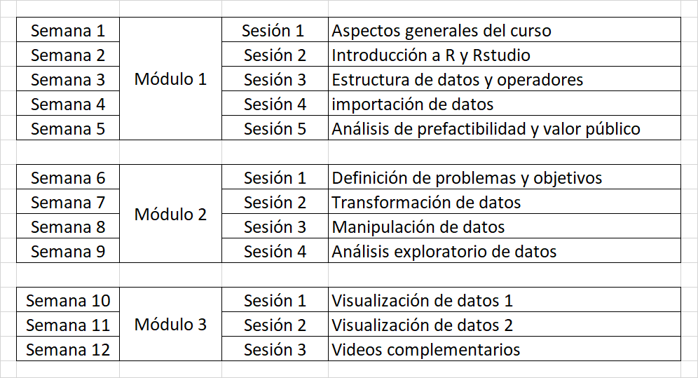

Versión 2

<http://datascience.opensaludlab.org>

 

# :point_right: [Ingresa acá](https://discord.gg/KuUEvFweVu) para unirte a la comunidad online del Bootcamp y comienza este viaje ahora!!

 

**Accede de forma libre y gratuita a:**  
:white_check_mark: +70 horas de clases pregrabadas  
:white_check_mark: +200 horas de recursos  
:white_check_mark: Documentación seleccionada  
:white_check_mark: Talleres en vivo  
:white_check_mark: Tutorías 1-1 y grupales  
:white_check_mark: Formato 100% online  
:white_check_mark: Nuevo material todos los meses

### Índice

1.  [Bienvenida](https://github.com/opensaludlab/ciencia_datos#bienvenida)
2.  [Objetivos](https://github.com/opensaludlab/ciencia_datos#objetivos)
3.  [Sobre el curso](https://github.com/opensaludlab/ciencia_datos#hugs-agradecimientos)
4.  [¿A quién está dirigido?](https://github.com/opensaludlab/ciencia_datos/blob/main/README.md#unicorn-a-qui%C3%A9n-est%C3%A1-dirigido)
5.  [Programa del curso](https://github.com/opensaludlab/ciencia_datos#loudspeaker-programa)
6.  [Módulos del curso](https://github.com/opensaludlab/ciencia_datos#left_speech_bubble-m%C3%B3dulos-del-curso)
7.  [Agradecimientos](https://github.com/opensaludlab/ciencia_datos#hugs-agradecimientos)
8.  [Dudas](https://github.com/opensaludlab/ciencia_datos/blob/main/README.md#dudas)

 

## :heart: ¿Nos ayudas?

Si encuentras interesante este proyecto y el contenido, te agradecemos mucho que marques la estrella del repositorio (busca la :star: de arriba y dale clic. Es como un clásico "me gusta" :+1:).

Además, sigue a OSL en nuestras cuentas de [Twitter](https://twitter.com/OpensaludLAB), [Instagram](https://www.instagram.com/opensaludlab/) y [LinkedIn](https://www.linkedin.com/company/opensaludlab).

Puedes visitarnos en [opensaludlab.org](http://www.opensaludlab.org)

 

## :wave: Bienvenida

El presente curso de ciencia de datos (*Data Science*) busca entregar herramientas técnicas y metodológicas para que profesionales de las más diversas disciplinas puedan realizar procesos de análisis de datos, diseñar modelos matemáticos y estadísticos y generar aplicaciones que les permitan hacer inteligencia con los datos e información en diversos ámbitos del sector público de salud. La principal fortaleza de la ciencia de datos, es que no restringe su desarrollo sólo a matemáticos o informáticos, sus herramientas pueden ser de dominio de distintas áreas, favoreciendo el trabajo inter y multidisciplinario, pues aporta una visión sistémica para comprender el comportamiento de sistemas complejos. Del mismo modo, hemos diseñado este curso para el sector público, buscando suplir la brecha que existe a la hora de pensar en qué problemas de diseño y gestión de políticas públicas son adecuados de resolver con datos.

## :cup_with_straw: Objetivos

El objetivo es el desarrollo progresivo de tu nivel de conocimientos técnicos y especializados en análisis avanzado de datos, programación y gestión de proyectos de ciencias de datos.

Además, vemos como un elemento valioso el incorporar este tipo de metodologías y conocimientos al interior de las instituciones públicas de salud, no solo para mejorar sus procesos habituales, sino que fundamentalmente, para ayudar en la toma de las mejores decisiones basadas en evidencia.

## :compass: Sobre el curso

Este repo fue usado como base del programa de formación que realizamos entre Diciembre 2020 y Junio 2021. Acá encontrarás practicamente todo el material (cerca del 85%) usado como los videos de las grabaciones de las sesiones en vivo, scripts, presentaciones y documentación complementaria.

En su versión original, el curso incluyó talleres y el desarrollo de proyectos de los alumnos, los cuales no están disponibles en esta versión.

De todas formas, tienes disponibles 24 clases con **más de 70 horas de video** en total. A eso, debes sumarle los videos complementarios, todos los ejercicios y lecturas, dando como resultado un curso bastante extenso, quizás el más grande en español actualmente, gratuito y de acceso libre.

No hemos querido ser demasiados exhaustivos en los temas. Usa este curso, más bien, como una guía de estudio (*roadmap*) y si necesitas profundizar en algo, tanto en la documentación complementaria como en otros recursos en internet seguramente podrás encontrar más información.

Pero debes saber algo desde ya!! Esto de la Ciencia de Datos (y la programación) es un constante aprendizaje. Siempre hay algo nuevo o cosas que aprender. Así que no te quedes solo con éste curso, ni con ningún otro solamente. Estudia mucho y practica, practica y practica...

### Novedades de esta versión

En esta nueva versión del Bootcamp tendremos disponible una [comunidad online](https://discord.gg/mpJadAbxYN) (en Discord) para que puedas acceder a otros materiales, hacer consultas, resolver tus dudas y compartir con el resto de los miembros. Y por qué no, ayudar a otros.  
Tendremos, también, nuevos talleres y sesiones en vivo para ir reforzando cada módulo.  
Además, se agregarán otros temas que vimos relevantes en la versión anterior como webscraping, control de versiones con GIT, series de tiempo y profundizar más en el manejo del paquete `Tidyverse` que permite transformar, manipular y limpiar datos.

Esto hace que el Bootcamp sea un curso, principalmente, autoadminstrado, en donde se mezclan actividades sincrónicas (sesiones en vivo) con asincrónicas (videos grabados, comunidad online, documentación, prácticas y lecturas) para profundizar en ciertos temas, resolver dudas o realizar talleres.

### ¿Por qué hemos liberado todo el curso?

Porque queremos democratizar el acceso al conocimiento avanzado y nos gustaría que más personas usen este tipo de metodologías para mejorar el sistema público de salud en beneficio de la ciudadanía.

Por ahora, tenemos disponibles los 3 primeros módulos, que son la base de la Ciencia de Datos y es donde reforzaremos esos conocimientos.

## :unicorn: ¿A quién está dirigido?

El Bootcamp está dirigido a todas las personas interesadas en introducirse en el área de la Ciencia de Datos y que quieren comenzar a aplicarla dentro de instituciones públicas de salud.

## :date: Cronograma

La idea es realizar 1 sesión a la semana, con un tiempo de dedicación de unas 5 horas aprox. Esto implica ver los videos de clases, revisar la documentación adicional, realizar los ejercicios y las prácticas recomendadas. Eso, al menos, pues si quieres desarrollar de mejor forma tus habilidades, es altamente relevante que busques más recursos y practiques mucho.

Además, este calendario será la base para la programación de las fechas de talleres y sesiones en vivo. Si sigues ese ritmo, podrás sacarle más provecho al Bootcamp y participar activamente de ellas.

La semana 1 corresponde a la primera de Septiembre 2021.

## :loudspeaker: Programa

El curso de Ciencia de Datos lo hemos dividido en 2 grandes áreas temáticas. El primero, llamado "Gestión y estrategia". Comprendemos que este tipo de temáticas están poco desarrolladas dentro de las organizaciones y por tanto, el grado de conocimientos específicos puede no ser muy elevado. Es en ese sentido, que este bloque tiene la finalidad de acercar al público a este tipo de proyectos e ir introduciendo paulatinamente a los participantes en ámbitos más técnicos y "duros", como pueden ser la programación y la estadística inferencial. Del mismo modo, abordaremos aspectos relevantes de estrategia, gestión y gobernanza de este tipo de proyectos.

Esperamos que con este bloque los participantes sean capaces de:

1.  Definir valor público
2.  Comprender el aporte de la ciencia de datos en la generación de valor público
3.  Entender los conceptos generales de la gestión de proyectos y su gobernanza
4.  Evaluar la factibilidad de usar la ciencia de datos para abordar un problema público
5.  Entender cómo definir los objetivos de un proyecto de ciencia de datos
6.  Comprender los desafíos éticos existentes en el diseño de un proyecto de datos

En la segunda área, llamada "Análisis de datos y programación", se abordará en detalle cómo diseñar un proyecto de datos y llevarlo a cabo. Se revisarán distintos aspectos metodológicos y técnicos para el desarrollo de este tipo de iniciativas, con un enfoque lo más práctico posible. Y si, acá revisaremos el uso de herramientas de software, programación\*\* y de distintos modelos estadísticos. Si bien no buscamos que seas un experto desarrollador, si esperamos que entiendas la lógica detrás del código, sus implicancias y que seas capaz de leer y elaborar informes estadísticos en base al código.

**El lenguaje de programación usado será R.**

Esperamos que con este segundo enfoque los participantes sean capaces de:

1.  Diseñar y planificar un proyecto de ciencia de datos
2.  Definir los alcances y requerimientos de los proyectos de datos en las instituciones públicas
3.  Comprender el pensamiento y lógica de programación
4.  Aplicar técnicas avanzadas de análisis estadísticos, tanto descriptivos como inferenciales
5.  Utilizar código para la transformación, limpieza, análisis, visualización y publicación de datos
6.  Analizar críticamente distintos proyectos e iniciativas de ciencias de datos

 

## :spiral_notepad:Certificado

Tener un certificado no certifica nada muchas veces. Las empresas más valoradas no los solicitan y es mucho más relevante tener un portafolio interesante y documentar adecuadamente tus proyectos.

El Bootcamp no incluye certificado de finalización, pero de todas formas te ayudamos a aprobar los siguientes cursos y certificados de IBM Cognitive Class:

-   [R 101](https://cognitiveclass.ai/courses/r-101)

-   [Machine Learning](https://cognitiveclass.ai/courses/machine-learning-r)

-   [Data Visualization](https://cognitiveclass.ai/courses/course-v1:CognitiveClass+DV0151EN+v1)

## :left_speech_bubble: Módulos del curso

Acá puedes acceder a las clases, documentación y scripts. Haz clic en cada módulo para entrar a las clases.

Nota: A lo largo del Bootcamp se agregarán más contenidos, talleres y temas. Varios de ellos son sugeridos por la comunidad online de Discord.

#### :point_right:[Antes de partir, revisa esta información](https://github.com/opensaludlab/ciencia_datos/tree/main/inicio)

## [MODULO 1: Nivelación y conceptos básicos](https://github.com/opensaludlab/ciencia_datos/tree/main/modulo1)

-   Aspectos generales curso
-   Introducción a R y RStudio
-   Estructura de datos y operadores
-   Importación de datos
-   Análisis prefactibilidad y valor público

## [MODULO 2: Data wrangling y análisis exploratorio de datos](https://github.com/opensaludlab/ciencia_datos/tree/main/modulo2)

(En colaboración con R-Ladies Concepción)

-   Definición de problemáticas y objetivos
-   Transformación de datos
-   Manipulación y limpieza de datos
-   Análisis exploratorio de datos

## [MODULO 3 : Visualización](https://github.com/opensaludlab/ciencia_datos/tree/main/modulo3)

(En colaboración con R-Ladies Concepción)

-   Visualización de datos (parte 1)
-   Visualización de datos (parte 2)

## [MODULO 4: Modelos y estadística inferencial](https://github.com/opensaludlab/ciencia_datos/tree/main/modulo4)

(En colaboración con Data UC)

-   Gestión ética de datos
-   Modelos estadísticos 1
-   Modelos estadísticos 2
-   Introducción al Machine Learning
-   Modelos de clasificación
-   Modelos de regresión

## [MODULO 5: Gestión de procesos](https://github.com/opensaludlab/ciencia_datos/tree/main/modulo5)

-   Conceptos generales de los procesos
-   Modelamiento BPMN
-   Modelamiento BPMN

## [MODULO 6: Comunicación y replicabilidad](https://github.com/opensaludlab/ciencia_datos/tree/main/modulo6)

-   RMarkdown (parte 1)
-   RMarkdown (parte 2)
-   Shiny (parte 1)
-   Shiny (parte 2)
-   Reportes replicables

## [Curso GIT](https://github.com/opensaludlab/ciencia_datos/tree/main/curso_git) (control de versiones)  

## :hugs: Agradecimientos

Este curso se hizo gracias a la ayuda y colaboración de muchas personas :muscle:

Queremos agradecer a:

La comunidad de [R-Ladies Concepción (Chile)](https://twitter.com/RLadiesConce), en especial a: Macarena Valenzuela, Camila Molina, Luisa Reyes y Natalia Riquelme.

[Data UC](http://datascience.uc.cl/) y la Facultad de Matemáticas de la Pontificia Universidad Católica de Chile, en especial a: Sebastián Massa, Ricardo Aravena y Alexis Alvear.

También agradecemos enormemente a [Patricio Araneda](https://www.linkedin.com/in/patricioaraneda/).

Y por supuesto, a los **más de 100 inscritos en el curso** en su primera versión, a la comunidad de OpenSalud LAB y a todos los que, con su apoyo, difusión y energía, ayudaron a que este proyecto fuese posible.

## :question: Dudas

Si tienes dudas sobre el Bootcamp, escríbenos a contacto\@opensaludlab.org
