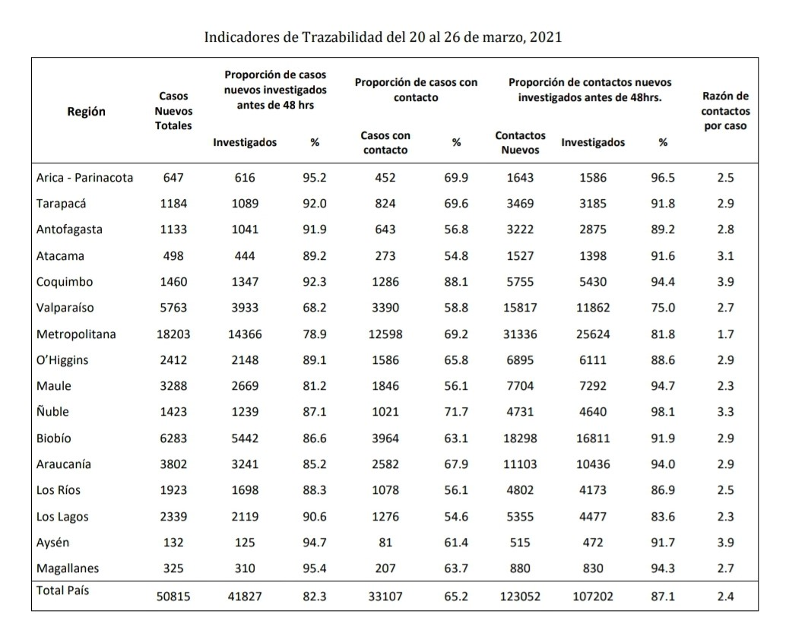

```{r setup, include=FALSE}
knitr::opts_chunk$set(echo = TRUE)
```

Este es un chunk:

```{r}

```


#  R Markdown

Este es un archivo de tipo *R Markdown* (`.Rmd`), en este tipo de archivos podemos de manera simple intercalar texto con código.
Ojo, que para insertar un párrafo es necesario saltarse 1 línea.

Estes es otro párrafo.

Para hacer un salto de línea, es necesario poner 2 espacios al final.  
Salto de línea.

El código se define en los "pedazos de código" (*code chunks*):

```{r cars}
summary(cars)
```

```{r}
# Una suma por ejemplo
2 + 2
```

```{r, fig.align='center', fig.width=5, fig.height=4}
# o un gráfico simple
x <- 1:10
y <- rnorm(10)
plot(x, y)
```


Y estos "pedazos de código" tienen distintas opciones que por ejemplos nos permiten solo motrar el resultado y no el código que lo genera (`echo = FALSE`):

```{r, echo = FALSE, fig.align='center', fig.width=5, fig.height=4}
hist(y)
```

# Formato de texto

Así como hay formas de manipular el código que trabajemos existe también una gran variedad de opciones para dar formato al texto que queramos incluir en un documento:

- *cursiva* 
- **negrita** 
- __*cursiva y negrita*__ 
- ~~tachado~~ 
- [link](http://www.opensaludlab.org) 
- `Objetos de código` 
- entre otras..

También podemos definir distintos niveles de jerarquía respecto a títulos y subtítulos


# Título 1 (`# Título 1`)
## Título 2 (`## Título 2`) 
### Título 3 (`### Título 3`)
#### Título 4 (`#### Título 4`)
##### Título 5 (`##### Título 5`)
###### Título 6 (`###### Título 6`)

Por otro lado, este tipo de archivo también nos facilita escribir formulas/operaciones/objetos matemáticos (con sintáxis $\LaTeX$) tanto en linea con el texto ($\sum_{i=1}^n X_i$) como en su propio párrafo:

$$\int_0^{2\pi} \sin x~dx$$ 

$$\mathbf{X} = \left[\begin{array}
{rrr}
1 & 2 & 3 \\
4 & 5 & 6 \\
7 & 8 & 9
\end{array}\right] $$


# Código en línea

Una de las principales caractéristicas que nos facilitará la creación de reportes automatizados es que no solo podemos escribir código en los "pedazos de código" (*code chunks*) sino que también podemos escribir **código en línea con el texto**.

```{r}
resultado <- 2 + 2
rel <- round(cor(x,y), 2)
```

La suma del cálculo hecho arriba es igual a **`r resultado`** y la correlación entre `x` e `y` es **`r rel`**.


# Incluir un plot

```{r pressure, echo=FALSE}
plot(pressure)
```

Note that the `echo = FALSE` parameter was added to the code chunk to prevent printing of the R code that generated the plot.

```{r rate, paged.print=TRUE, rows.print=10}

library(tidyverse)
cars2 <- cars %>% 
  mutate(rate = round(speed/dist, 1))

DT::datatable(cars2, extensions = c("FixedColumns","FixedHeader"),
              options = list(scrollX = TRUE,
                             paging = TRUE,
                             fixedHeader = TRUE))
```

# Gráfico

Ahora incluyamos un gráfico

```{r tta, fig.width=12, fig.align='center', fig.cap="Fuente: Reporte de trazabilidad MINSAL"}


```

También podemos agregar código en el texto (inline code)

```{r}
median_iris <- iris %>% 
  group_by(Species) %>% 
  summarise(Petal.Length.Median = median(Petal.Length)) %>% 
  ungroup()
median_iris
```


La especie con mediana más alta del largo del pétalo es `r max(median_iris$Petal.Length.Median)`


